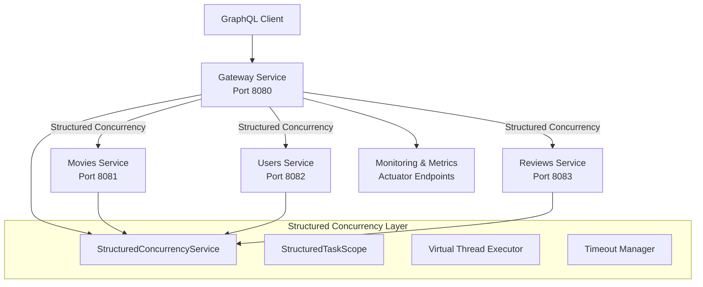
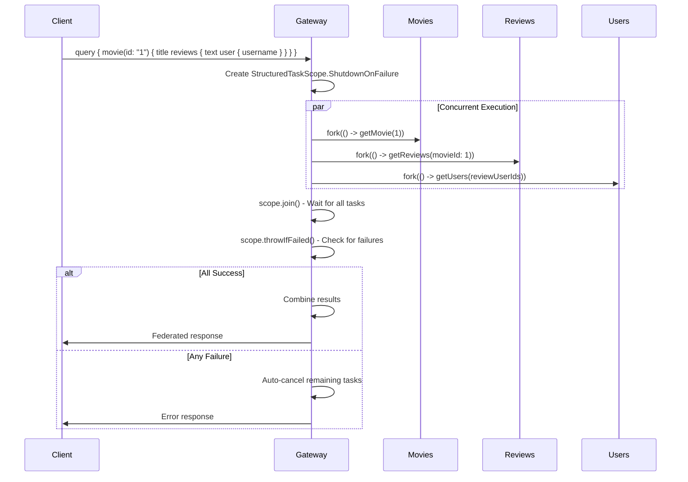

# Netflix-Style GraphQL Microservices with JDK 24 Structured Concurrency

This is my modern take on Netflix's federated GraphQL architecture! This project is intended to showcase how to build high-performance microservices using JDK 24's cutting-edge structured concurrency features alongside virtual threads.

## What Makes This Special

This isn't just another demo - I am aiming to deliver apractical implementation that solves real-world problems you'd face at scale. I've built a movie streaming platform backend that handles concurrent data fetching across multiple services while maintaining reliability and performance.

### Key Highlights

🚀 **JDK 24 Structured Concurrency**: Uses `StructuredTaskScope` for bulletproof concurrent operations  
🧵 **Virtual Threads**: Handles massive concurrency with minimal resource overhead  
🔗 **GraphQL Federation**: Seamlessly combines data from multiple services  
⚡ **Performance First**: Built for high-throughput, low-latency scenarios  
🛡️ **Resilient Design**: Automatic timeout handling and fail-fast behavior  
📊 **Production Ready**: Comprehensive monitoring and metrics

## The Problem We're Solving

Traditional microservices often struggle with:
- Complex async programming patterns
- Resource-heavy thread management
- Difficult error propagation across services
- Timeout and retry complexity
- Performance bottlenecks in federated queries

This solution leverages JDK 24's structured concurrency to make concurrent programming as simple as sequential code, while virtual threads handle massive scale effortlessly.

## Quick Start

### Prerequisites
- JDK 24 (or JDK 21 for development)
- Docker & Docker Compose
- Gradle 8.8+

### Running the Services
```bash
# Build all services
./gradlew build

# Start with Docker Compose
docker-compose up -d

# Or run individual services
./gradlew :services:gateway-service:bootRun
./gradlew :services:movies-service:bootRun
./gradlew :services:reviews-service:bootRun
./gradlew :services:users-service:bootRun
```

### Try It Out
Once running, visit:
- **GraphQL Playground**: http://localhost:8080/graphiql
- **Gateway Health**: http://localhost:8080/actuator/health
- **Metrics**: http://localhost:8080/actuator/metrics

## Key Architectural Decisions

### Why Structured Concurrency?
Traditional async programming with CompletableFuture chains becomes complex and error-prone at scale. Structured concurrency provides:

- **Automatic Resource Management**: Tasks are automatically cancelled when their parent scope ends
- **Clear Error Propagation**: Failures bubble up predictably without complex exception handling
- **Simplified Debugging**: Stack traces remain readable and meaningful
- **Guaranteed Cleanup**: No more leaked threads or hanging operations

### Why Virtual Threads?
Virtual threads solve the classic thread-per-request scalability problem:

- **Massive Concurrency**: Handle millions of concurrent requests with minimal memory
- **Blocking-Friendly**: Write simple blocking code that scales like async
- **Existing Code Compatible**: Drop-in replacement for traditional threads
- **Resource Efficient**: Orders of magnitude less memory per thread

### Service Communication Strategy
We chose a hybrid approach for inter-service communication:

- **Synchronous GraphQL Federation**: For user-facing queries requiring immediate consistency
- **Structured Concurrency**: For coordinating multiple service calls efficiently  
- **Circuit Breakers**: For resilience against cascading failures
- **Graceful Degradation**: Non-critical data can fail without breaking the entire response

### Data Consistency Model
- **Eventually Consistent**: Between services for performance
- **Strongly Consistent**: Within service boundaries
- **Compensating Actions**: For distributed transaction scenarios

## Architecture

### High-Level Architecture



### Concurrency Flow Pattern



## Components and Interfaces

### 1. Enhanced StructuredConcurrencyService

**Location**: `services/gateway-service/src/main/java/com/netflix/gateway/service/StructuredConcurrencyService.java`

```java
@Service
public class StructuredConcurrencyService {
    
    // Federated data fetching with multiple services
    public <T> T executeFederatedQuery(List<Supplier<Object>> tasks, 
                                      Function<List<Object>, T> combiner) throws Exception;
    
    // Batch operations with individual timeouts
    public <T> List<T> executeBatch(List<Supplier<T>> tasks, 
                                   Duration timeout) throws Exception;
    
    // Retry-enabled structured concurrency
    public <T> T executeWithRetry(Supplier<T> task, 
                                 RetryPolicy retryPolicy) throws Exception;
    
    // Performance monitoring wrapper
    public <T> T executeWithMetrics(String operationName, 
                                   Supplier<T> task) throws Exception;
}
```

### 2. GraphQL Federation Resolvers

**Location**: `services/gateway-service/src/main/java/com/netflix/gateway/graphql/`

```java
@Controller
public class FederatedMovieResolver {
    
    @Autowired
    private StructuredConcurrencyService concurrencyService;
    
    @Autowired
    private ServiceClientManager serviceClientManager;
    
    @QueryMapping
    public MovieWithDetails movie(@Argument String id) throws Exception;
    
    @SchemaMapping(typeName = "Movie", field = "reviews")
    public List<Review> movieReviews(Movie movie) throws Exception;
    
    @BatchMapping(typeName = "Review", field = "user")
    public Map<Review, User> reviewUsers(List<Review> reviews) throws Exception;
}
```

### 3. Service Client Manager

**Location**: `services/gateway-service/src/main/java/com/netflix/gateway/client/ServiceClientManager.java`

```java
@Component
public class ServiceClientManager {
    
    private final WebClient webClient;
    private final ServiceConfiguration config;
    
    // Structured concurrency-enabled service calls
    public CompletableFuture<MovieDto> getMovie(Long id);
    public CompletableFuture<List<ReviewDto>> getReviews(Long movieId);
    public CompletableFuture<List<UserDto>> getUsers(List<Long> userIds);
    
    // Batch operations
    public CompletableFuture<List<MovieDto>> getMovies(List<Long> ids);
    
    // Health check with timeout
    public CompletableFuture<Boolean> checkServiceHealth(String serviceName);
}
```

### 4. Configuration Management

**Location**: `services/gateway-service/src/main/java/com/netflix/gateway/config/StructuredConcurrencyProperties.java`

```java
@ConfigurationProperties(prefix = "structured-concurrency")
@Data
public class StructuredConcurrencyProperties {
    
    private Duration defaultTimeout = Duration.ofSeconds(5);
    private Map<String, Duration> serviceTimeouts = new HashMap<>();
    private RetryConfiguration retry = new RetryConfiguration();
    private MonitoringConfiguration monitoring = new MonitoringConfiguration();
    
    @Data
    public static class RetryConfiguration {
        private int maxAttempts = 3;
        private Duration backoffDelay = Duration.ofMillis(100);
        private double backoffMultiplier = 2.0;
    }
    
    @Data
    public static class MonitoringConfiguration {
        private boolean enabled = true;
        private Duration metricsInterval = Duration.ofSeconds(30);
        private List<String> trackedOperations = new ArrayList<>();
    }
}
```

### 5. Performance Monitoring

**Location**: `services/gateway-service/src/main/java/com/netflix/gateway/monitoring/StructuredConcurrencyMetrics.java`

```java
@Component
public class StructuredConcurrencyMetrics {
    
    private final MeterRegistry meterRegistry;
    private final Timer.Builder timerBuilder;
    private final Counter.Builder counterBuilder;
    
    // Metrics collection
    public void recordOperationTime(String operation, Duration duration);
    public void recordOperationSuccess(String operation);
    public void recordOperationFailure(String operation, String errorType);
    public void recordConcurrentTasks(String operation, int taskCount);
    public void recordTimeoutOccurrence(String operation);
    
    // Virtual thread metrics
    public void recordVirtualThreadCount();
    public void recordVirtualThreadCreation();
    public void recordVirtualThreadDestruction();
}
```

## Data Models

### 1. Federated Response Models

```java
// Enhanced DTOs for federated responses
public record MovieWithDetails(
    MovieDto movie,
    List<ReviewWithUser> reviews,
    MovieStats stats
) {}

public record ReviewWithUser(
    ReviewDto review,
    UserDto user
) {}

public record MovieStats(
    Float averageRating,
    Integer reviewCount,
    Integer userCount
) {}
```

### 2. Service Communication Models

```java
// Service call configuration
public record ServiceCall<T>(
    String serviceName,
    String endpoint,
    Duration timeout,
    Class<T> responseType,
    Map<String, Object> parameters
) {}

// Batch operation result
public record BatchResult<T>(
    List<T> successful,
    List<ServiceError> failed,
    Duration totalTime,
    Map<String, Duration> individualTimes
) {}
```

### 3. Error Handling Models

```java
// Structured concurrency specific errors
public class StructuredConcurrencyException extends Exception {
    private final String operation;
    private final List<String> failedServices;
    private final Duration executionTime;
}

public record ServiceError(
    String serviceName,
    String operation,
    String errorMessage,
    String errorType,
    Duration attemptTime
) {}
```

## Error Handling

### 1. Failure Propagation Strategy

```java
// Fail-fast with automatic cancellation
try (var scope = new StructuredTaskScope.ShutdownOnFailure()) {
    var movieTask = scope.fork(() -> serviceClient.getMovie(id));
    var reviewsTask = scope.fork(() -> serviceClient.getReviews(id));
    var usersTask = scope.fork(() -> serviceClient.getUsers(userIds));
    
    scope.join();
    scope.throwIfFailed(); // Automatically cancels remaining tasks on failure
    
    return combineResults(movieTask.resultNow(), reviewsTask.resultNow(), usersTask.resultNow());
}
```

### 2. Partial Failure Handling

```java
// Graceful degradation for non-critical data
try (var scope = new StructuredTaskScope.ShutdownOnSuccess<>()) {
    // Critical data - must succeed
    var movieTask = scope.fork(() -> serviceClient.getMovie(id));
    
    // Optional data - can fail gracefully
    var reviewsTask = scope.fork(() -> {
        try {
            return serviceClient.getReviews(id);
        } catch (Exception e) {
            return Collections.emptyList(); // Graceful fallback
        }
    });
    
    scope.join();
    return buildResponse(movieTask.resultNow(), reviewsTask.resultNow());
}
```

### 3. Timeout and Retry Logic

```java
// Configurable timeout with exponential backoff retry
public <T> T executeWithRetryAndTimeout(Supplier<T> task, String operation) throws Exception {
    RetryPolicy policy = retryPolicies.get(operation);
    Duration timeout = serviceTimeouts.getOrDefault(operation, defaultTimeout);
    
    for (int attempt = 1; attempt <= policy.maxAttempts(); attempt++) {
        try {
            return executeWithTimeout(task, timeout.toMillis());
        } catch (TimeoutException e) {
            if (attempt == policy.maxAttempts()) {
                throw new StructuredConcurrencyException("Operation timed out after " + attempt + " attempts", operation);
            }
            Thread.sleep(policy.backoffDelay().toMillis() * (long) Math.pow(policy.backoffMultiplier(), attempt - 1));
        }
    }
    throw new StructuredConcurrencyException("Retry attempts exhausted", operation);
}
```

## Testing Strategy

### 1. Unit Testing Approach

```java
@ExtendWith(MockitoExtension.class)
class StructuredConcurrencyServiceTest {
    
    @Test
    void shouldExecuteFederatedQuerySuccessfully() throws Exception {
        // Test successful concurrent execution
    }
    
    @Test
    void shouldCancelRemainingTasksOnFailure() throws Exception {
        // Test fail-fast behavior
    }
    
    @Test
    void shouldHandleTimeoutsCorrectly() throws Exception {
        // Test timeout scenarios
    }
    
    @Test
    void shouldRetryFailedOperations() throws Exception {
        // Test retry logic
    }
}
```

### 2. Integration Testing Strategy

```java
@SpringBootTest
@TestPropertySource(properties = {
    "structured-concurrency.default-timeout=PT2S",
    "structured-concurrency.retry.max-attempts=2"
})
class FederatedGraphQLIntegrationTest {
    
    @Test
    void shouldExecuteFederatedMovieQuery() {
        // Test complete federated query flow
    }
    
    @Test
    void shouldHandleServiceFailureGracefully() {
        // Test service failure scenarios
    }
    
    @Test
    void shouldMeetPerformanceRequirements() {
        // Test performance benchmarks
    }
}
```

### 3. Load Testing Framework

```java
@Component
public class StructuredConcurrencyLoadTest {
    
    public LoadTestResult executeConcurrentLoad(int concurrentUsers, Duration testDuration) {
        // Simulate high concurrent load
        // Measure virtual thread performance
        // Compare with traditional thread pool performance
    }
    
    public PerformanceComparison compareWithTraditionalApproach() {
        // Benchmark structured concurrency vs traditional approaches
    }
}
```

### 4. Performance Monitoring Tests

```java
@Test
void shouldExposeVirtualThreadMetrics() {
    // Verify virtual thread metrics are available
    // Check structured concurrency operation metrics
    // Validate timeout and failure rate tracking
}

@Test
void shouldProvidePerformanceInsights() {
    // Test performance monitoring capabilities
    // Verify bottleneck identification
    // Check resource utilization tracking
}
```

## Implementation Phases

### Phase 1: Core Infrastructure
- Enhanced StructuredConcurrencyService with federation support
- Service client manager with WebClient integration
- Configuration management for timeouts and retry policies
- Basic error handling and logging

### Phase 2: GraphQL Federation
- Federated resolvers using structured concurrency
- Batch data loading with concurrent execution
- Cross-service data aggregation
- Schema mapping with concurrent field resolution

### Phase 3: Monitoring and Metrics
- Performance metrics collection
- Virtual thread monitoring
- Operation success/failure tracking
- Timeout and retry metrics

### Phase 4: Advanced Features
- Load testing framework
- Performance comparison tools
- Advanced retry strategies
- Circuit breaker integration

This design provides a comprehensive foundation for implementing structured concurrency patterns that address all the missing capabilities while maintaining the existing architecture's integrity and performance characteristics.